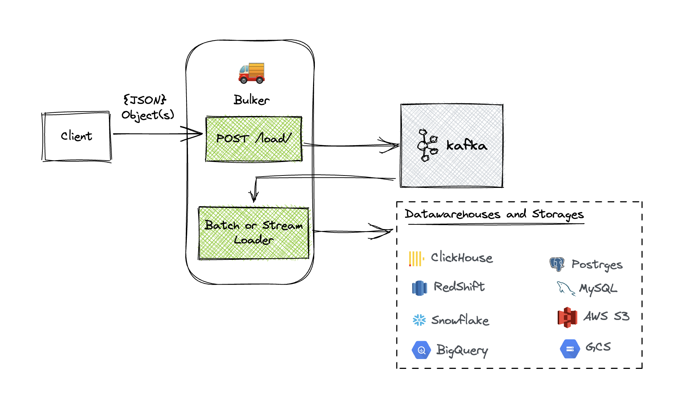
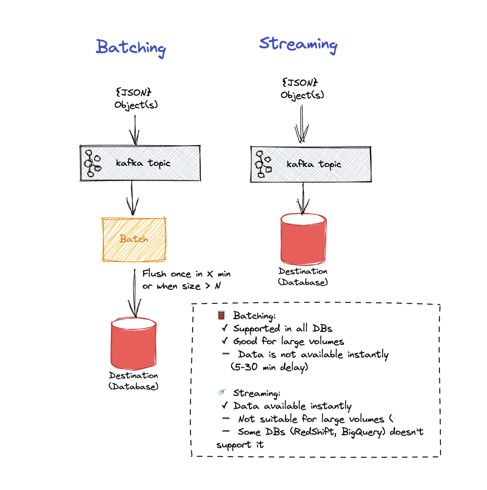

# 🚚 Bulker

Bulker is a tool for streaming and batching large amount of semi-structured data into data warehouses. It uses Kafka internally

## How it works?

Send and JSON object to Bulker HTTP endpoint, and it will make sure it will be saved to data warehouse:
 
 * **JSON flattening**. Your object will be flattened - `{a: {b: 1}}` becomes `{a_b: 1}`
 * **Schema managenent** for **semi-structured** data. For each field, bulker will make sure that a corresponding column exist in destination table. If not, Bulker
will create it. Type will be best-guessed by value, or it could be explicitely set via type hint as in `{"a": "test", "__sql_type_a": "varchar(4)"}`
 * **Reliability**. Bulker will put the object to Kafka Queue immediately, so if datawarehouse is down, data won't be lost
 * **Streaming** or **Batching**. Bulker will send data to datawarehouse either as soon it become available  in Kafka (streaming) or after some time (batching). Most
data warehouses won't tolerate large number of inserts, that's why we implemented batching

Bulker is a 💜 of [Jitsu](https://github.com/jitsucom/jitsu), an open-source data integration platform.

See full list of features below

Bulker is also available as a go library if you want to embed it into your application as opposed to use a HTTP-server

## Features

* 🛢️ **Batching** - Bulker sends data in batches in most efficient way for particular database. For example, for Postgres it uses 
COPY command, for BigQuery it uses batch-files
* 🚿 **Streaming** - alternatively, Bulker can stream data to database. It is useful when number of records is low. Up to 10 records
per second for most databases
* 🐫 **Deduplication** - if configured, Bulker will deduplicate records by primary key 
* 📋 **Schema management** - Bulker creates tables and columns on the fly. It also flattens nested JSON-objects. Example if you send `{"a": {"b": 1}}` to 
bulker, it will make sure that there is a column `a_b` in the table (and will create it)
* 🦾 **Implicit typing** - Bulker infers types of columns from JSON-data.
* 📌 **Explicit typing** - Explicit types can be by type hints that are placed in JSON. Example: for event `{"a": "test", "__sql_type_a": "varchar(4)"}`
Bulker will make sure that there is a column `a`, and it's type is `varchar(4)`.
* 📈 **Horizontal Scaling**. Bulker scales horizontally. Too much data? No problem, just add Bulker instances!
* 📦 **Dockerized** - Bulker is dockerized and can be deployed to any cloud provider and k8s. 
* ☁️ **Cloud Native** - each Bulker instance is stateless and is configured by only few environment variables. 

## Supported databases

Bulker supports the following databases:

 * ✅ PostgresSQL  
 * ✅ Redshit  
 * ✅ Snowflake  
 * ✅ Clickhouse  
 * ✅ BigQuery  
 * ✅ MySQL  
 * ✅ S3  
 * ✅ GCS  

Please see  [Compatibility Matrix](.docs/db-feature-matrix.md) to learn what Bulker features are supported by each database.

## Documentation Links

> **Note**
> We highly recommend to read [Core Concepts](#core-concepts) below before diving into details

* [How to use Bulker as HTTP Service](./.docs/server-config.md)
  * [Server Configuration](./.docs/server-config.md)  
  * [HTTP API](./.docs/http-api.md)
* How to use bulker as Go-lib *(coming soon)*

## Core Concepts

### Destinations

Bulker operates with destinations. Destination is database or
storage service (e.g. S3, GCS). Each destination has an ID and configuration
which is represented by JSON object.

Bulker exposes HTTP API to load data into destinations, where those
destinations are referenced by their IDs.

If destination is a database, you'll need to provide a destination table name.

### Event

The main unit of data in Bulker is an *event*. Event is a represented JSON-object 

### Batching and Streaming (aka Destination Mode)

Bulker can send data to database in two ways:
 * **Streaming**. Bulker sends evens to destinaion one by one. It is useful when number of events is low (less than 10 events per second for most DBs).
 * **Batching**. Bulker accumulates events in batches and sends them periodically once batch is full or timeout is reached. Batching is more efficient for large amounts of events. Especially for cloud data-warehouses 
(e.g. Postgres, Clickhouse, BigQuery).

### Primary Keys and Deduplication

Optionally, Bulker can deduplicate events by primary key. It is useful when you same event can be sent to Bulker multiple times.
If available, Bulker uses primary keys, but for some data warehouses alternative strategies are used.

>[Read more about deduplication »](./.docs/db-feature-matrix.md)

